# Working with the Web Part Property Pane

In this lab you work with the SharePoint Framework (SPFx) to extend client-side web parts using the property pane.

## In this lab

- [Working with the web part property pane](#exercise1)
- [Building custom property pane fields](#exercise2)
- [Leveraging the SPFx PnP Reusable Property Pane Controls](#exercise3)

## Prerequisites

To complete this lab, you need the following:

- Office 365 tenancy
  > If you do not have one, you obtain one (for free) by signing up to the [Office 365 Developer Program](https://developer.microsoft.com/office/dev-program).
- Local SharePoint Framework development environment installed and configured
  - Refer to the SharePoint Framework documentation, specifically the **[Getting Started > Set up development environment](https://docs.microsoft.com/sharepoint/dev/spfx/set-up-your-development-environment)** for the most current steps

<a name="exercise1"></a>

## Exercise 1: Working with the web part property pane

In this exercise, you will get hands-on experience in manipulating the property pane for a SPFx client-side web part in working with controls, groups and pages.

### Create a new SPFx Solution & Web Part

> NOTE: The instructions below assume you are using v1.8.2 of the SharePoint Framework Yeoman generator.

1. Open a command prompt and change to the folder where you want to create the project.
1. Run the SharePoint Framework Yeoman generator by executing the following command:

    ```shell
    yo @microsoft/sharepoint
    ```

    Use the following to complete the prompt that is displayed:

    - **What is your solution name?:** HelloPropertyPane
    - **Which baseline packages do you want to target for your component(s)?:** SharePoint Online only (latest)
    - **Where do you want to place the files?:** Use the current folder
    - **Do you want to allow the tenant admin the choice of being able to deploy the solution to all sites immediately without running any feature deployment or adding apps in sites?:** No
    - **Will the components in the solution require permissions to access web APIs that are unique and not shared with other components in the tenant?:** No
    - **Which type of client-side component to create?:** WebPart
    - **What is your Web part name?:** HelloPropertyPane
    - **What is your Web part description?:** HelloPropertyPane description
    - **Which framework would you like to use?:** No JavaScript framework

1. Verify everything is working. Execute the following command to build, start the local web server and test the web part in the local workbench:

    ```shell
    gulp serve
    ```

1. When the browser loads the local workbench, select the **Add a new web part** control...

    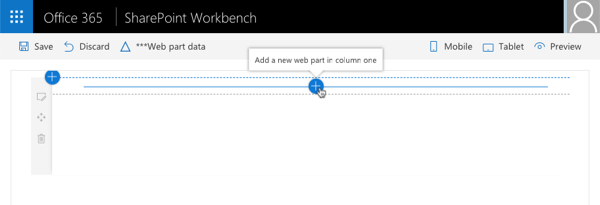

   ...and select the **HelloPropertyPane** web part to add the web part to the page:

    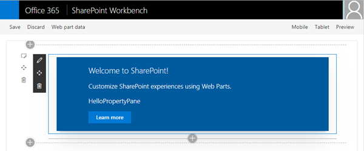

1. Select the **edit web part** control to the side of the web part to display the property pane:

    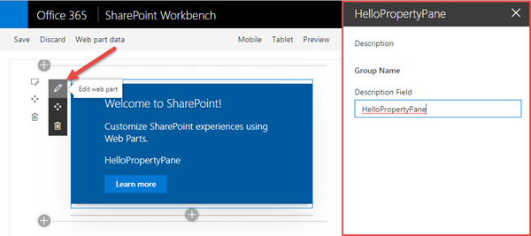

### Add New Properties to the web part

With a working web part, the next step is to customize the property pane experience.

1. Create two new properties that will be used in the web part and property pane:
    1. Open the file **src\webparts\helloPropertyPane\HelloPropertyPaneWebPart.ts**
    1. Locate the interface `IHelloPropertyPaneWebPartProps` after the `import` statements. Add the following two properties to the interface:

    ```ts
    myContinent: string;
    numContinentsVisited: number;
    ```

1. Update the web part rendering to display the values of these two properties:
    1. within the `HelloPropertyPaneWebPart` class, locate the `render()` method.
    1. Within the `render()` method, locate the following line in the HTML output:

        ```html
        <p class="${ styles.description }">${escape(this.properties.description)}</p>
        ```

    1. Add the following two lines after the line you just located:

        ```html
        <p class="${ styles.description }">Continent where I reside: ${escape(this.properties.myContinent)}</p>
        <p class="${ styles.description }">Number of continents I've visited: ${this.properties.numContinentsVisited}</p>
        ```

    At the moment the web part will render a blank string and undefined for these two fields as nothing is present in their values:

      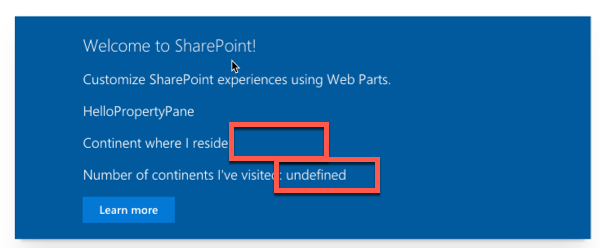

    This can be addressed by setting the default values of properties when a web part is added to the page.

1. Set the default property values:
    1. Open the file **src\webparts\helloPropertyPane\HelloPropertyPaneWebPart.manifest.json**
    1. Locate the following section in the file: `preconfiguredEntries[0].properties.description`
    1. Add a comma after the `description` property's value.
    1. Add the following two lines after the `description` property:

        ```json
        "myContinent": "North America",
        "numContinentsVisited": 4
        ```

1. Updates to the web part's manifest file will not be picked up until you restart the local web server.
    1. In the command prompt, press <kbd>CTRL+C</kbd> to stop the local web server.
    1. Rebuild and restart the local web server by executing the command `gulp serve`.
    1. When the SharePoint workbench loads, add the web part back tot he page to see the properties.

        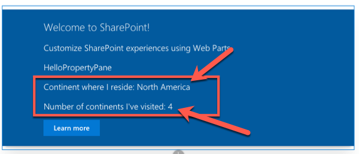

### Extend the Property Pane

Now that the web part has two new custom properties, the next step is to extend the property pane to allow users to edit the values.

1. Add a new text control to the property pane, connected to the **myContinent** property:
    1. Open the file **src\webparts\helloPropertyPane\HelloPropertyPaneWebPart.ts**
    1. Locate the method `getPropertyPaneConfiguration` & within it, locate the `groupFields` array.
    1. Add a comma after the existing `PropertyPaneTextField()` call.
    1. Add the following code after the comma:

        ```ts
        PropertyPaneTextField('myContinent', {
          label: 'Continent where I currently reside'
        })
        ```

1. If the local web server is not running, start it by executing `gulp serve`.

    Once the SharePoint workbench is running again, add the web part to the page and open the property pane.

    Notice you can see the property and text box in the property pane. Any edits to the field will automatically update the web part:

    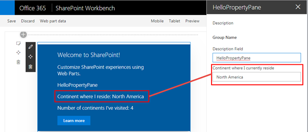

1. Now add a slider control to the property pane, connected to the **numContinentsVisited** property:
    1. In the **HelloPropertyPaneWebPart.ts**, at the top of the file, add a `PropertyPaneSlider` reference to the existing `import` statement for the `@microsoft/sp-webpart-base` package.
    1. Scroll down to the method `getPropertyPaneConfiguration` & within it, locate the `groupFields` array.
    1. Add a comma after the last `PropertyPaneTextField()` call, add the following code:

        ```ts
        PropertyPaneSlider('numContinentsVisited', {
          label: 'Number of continents I\'ve visited',
          min: 1, max: 7, showValue: true,
        })
        ```

    1. Notice the property pane now has a slider control to control the number of continents you have visited:

        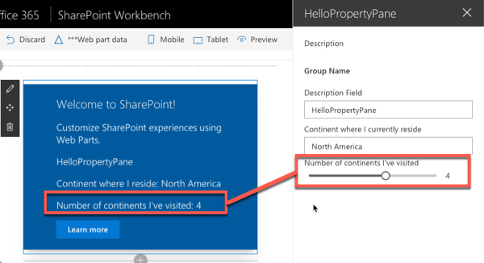

### Add Control Validation

In a previous step the user was given a property where they could enter the name of the continent in which they live. Add validation logic to ensure they enter a valid continent name.

1. In the **HelloPropertyPaneWebPart.ts**, add the following method to the `HelloPropertyPaneWebPart` class. This method takes a string as an input and returns a string. This allows you to do custom validation logic. If this method returns an empty string, the value is considered valid; otherwise, the returned string is used as the error message.

    ```ts
    private validateContinents(textboxValue: string): string {
      const validContinentOptions: string[] = ['africa', 'antarctica', 'asia', 'australia', 'europe', 'north america', 'south america'];
      const inputToValidate: string = textboxValue.toLowerCase();

      return (validContinentOptions.indexOf(inputToValidate) === -1)
        ? 'Invalid continent entry; valid options are "Africa", "Antarctica", "Asia", "Australia", "Europe", "North America", and "South America"'
        : '';
    }
    ```

1. Wire the validation method to the text field control previously added.
    1. Locate the text field that is associated with the **myContinent** property.
    1. Add the following code to the options object passed into the `PropertyPaneTextField()` call as the second parameter: `onGetErrorMessage: this.validateContinents.bind(this)`.

        The text field control should now look like the following code: 

        ```ts
        PropertyPaneTextField('myContinent', {
          label: 'Continent where I currently reside',
          onGetErrorMessage: this.validateContinents.bind(this)
        }),
        ```

1. If the local web server is not running, start it by executing `gulp serve`.

    Once the SharePoint workbench is running again, add the web part to the page and open the property pane.

1. Enter the name of a non-existent continent to test the validation logic:

    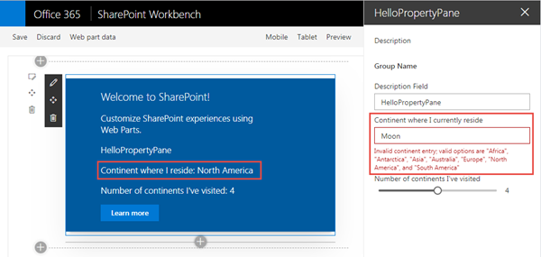

    Notice the property value is not updated when the control's input is invalid.

<a name="exercise2"></a>

## Exercise 2: Building custom property pane fields

In this exercise, you will extend the property pane by creating your own custom field control.

### Create custom dropdown control of continents

1. Open a command prompt and change to the root folder of the project created in the last exercise.

    > NOTE: If you did not create the project in the previous exercise, you will find a complete working version that you can start from in the **[Demos\01-proppane](/Demos/01-proppane)** folder.

1. Within the project, locate the **src** folder and create a subfolder **controls**.
1. Create a new folder **PropertyPaneContinentSelector** within the **controls** folder to contain the new drop down control.
1. Custom property pane controls should be created using React & Fabric React to match the same user interface as the native controls. A custom React component is included in the **LabFiles** associated with this lab.

    Copy the folder **[LabFiles\components](./LabFiles/components)** into the **src/controls/PropertyPaneContinentSelector** folder in the project.

1. Create an interface for the public properties that can be set as options on the custom property pane control you will build in a moment:
    1. Create a new file **IPropertyPaneContinentSelectorProps.ts** in the **src/controls/PropertyPaneContinentSelector** folder.
    1. Add the following code to the **IPropertyPaneContinentSelectorProps.ts** file:

        ```ts
        import { IDropdownOption } from 'office-ui-fabric-react/lib/components/Dropdown';

        export interface IPropertyPaneContinentSelectorProps {
          label: string;
          onPropertyChange: (propertyPath: string, newValue: any) => void;
          selectedKey: string | number;
          disabled: boolean;
        }
        ```

1. Create another interface that merges both the properties for the custom control and the custom property pane control interface:
    1. Create a new file **IPropertyPaneContinentSelectorInternalProps.ts** in the **src/controls/PropertyPaneContinentSelector** folder.
    1. Add the following code to the **IPropertyPaneContinentSelectorInternalProps.ts** file:

        ```ts
        import { IPropertyPaneCustomFieldProps } from '@microsoft/sp-webpart-base';
        import { IPropertyPaneContinentSelectorProps } from './IPropertyPaneContinentSelectorProps';

        export interface IPropertyPaneContinentSelectorInternalProps extends IPropertyPaneCustomFieldProps, IPropertyPaneContinentSelectorProps { }
        ```

1. Simplify importing the public parts of the control by creating a barrel that exports everything:
    1. Create a new file **index.ts** in the **src/controls/PropertyPaneContinentSelector** folder.
    1. Add the following code to the file:

        ```ts
        export * from './IPropertyPaneContinentSelectorProps';
        export * from './IPropertyPaneContinentSelectorInternalProps';
        export * from './PropertyPaneContentSelector';
        ```

1. Now create the custom property pane control. This control will load a React control and wire up the properties provided to the control to the public properties on the React control:
    1. Create a new file named **PropertyPaneContentSelector.ts** in the **src/controls/PropertyPaneContinentSelector** folder.
    1. Add the following `import` statements to the top of the file:

        ```ts
        import * as React from 'react';
        import * as ReactDom from 'react-dom';
        import { 
          IPropertyPaneField, 
          PropertyPaneFieldType 
        } from '@microsoft/sp-webpart-base';
        import { IDropdownOption } from 'office-ui-fabric-react/lib/components/Dropdown';
        import { IContinentSelectorProps } from './components/IContinentSelectorProps';
        import ContinentSelector from './components/ContinentSelector';
        import { 
          IPropertyPaneContinentSelectorProps,
          IPropertyPaneContinentSelectorInternalProps,
        } from './';
        ```

    1. Next, declare the new class that implements the `IPropertyPaneField` interface provided by the SPFx API with a few class members:

        ```ts
        export class PropertyPaneContinentSelector implements IPropertyPaneField<IPropertyPaneContinentSelectorProps> {
          public type: PropertyPaneFieldType = PropertyPaneFieldType.Custom;
          public properties: IPropertyPaneContinentSelectorInternalProps;
          private element: HTMLElement;

          constructor(public targetProperty: string, properties: IPropertyPaneContinentSelectorProps) {
            this.properties = {
              key: properties.label,
              label: properties.label,
              disabled: properties.disabled,
              selectedKey: properties.selectedKey,
              onPropertyChange: properties.onPropertyChange,
              onRender: this.onRender.bind(this)
            };
          }

          public render(): void {
            if (!this.element) {
              return;
            }
          }
        }
        ```

    1. Add the following two methods to the `PropertyPaneContinentSelector` class that will create the React component and render it on the page as well as wire up the change event when the selection changes:

        ```ts
        private onRender(element: HTMLElement): void {
          if (!this.element) {
            this.element = element;
          }

          const reactElement: React.ReactElement<IContinentSelectorProps> = React.createElement(ContinentSelector, <IContinentSelectorProps>{
            label: this.properties.label,
            onChanged: this.onChanged.bind(this),
            selectedKey: this.properties.selectedKey,
            disabled: this.properties.disabled,
            stateKey: new Date().toString() // hack to allow for externally triggered re-rendering
          });
          ReactDom.render(reactElement, element);
        }

        private onChanged(option: IDropdownOption, index?: number): void {
          this.properties.onPropertyChange(this.targetProperty, option.key);
        }
        ```

### Implement the custom property pane control

With the custom property pane control created, you can now replace the existing text box control with the new control.

1. Locate and open the **src/webparts/helloPropertyPane/HelloPropertyPaneWebPart.ts** file.
1. Add the following `import` statement to the top of the file after the existing `import` statements:

    ```ts
    import {
      PropertyPaneContinentSelector,
      IPropertyPaneContinentSelectorProps
    } from '../../controls/PropertyPaneContinentSelector';
    ```

1. Locate the `getPropertyPaneConfiguration()` method in the web part, then find the existing `PropertyPaneTextField` that's bound to the **myContinent** property. Comment this control out
1. Add the following custom control to the property pane:

    ```ts
    new PropertyPaneContinentSelector('myContinent', <IPropertyPaneContinentSelectorProps>{
      label: 'Continent where I currently reside',
      disabled: false,
      selectedKey: this.properties.myContinent,
      onPropertyChange: this.onContinentSelectionChange.bind(this),
    }),
    ```

1. Add the following method to the `HelloPropertyPaneWebPart` class to handle the event when a user changes the selection in the control. This will update the property on the web part:

    ```ts
    private onContinentSelectionChange(propertyPath: string, newValue: any): void {
      const oldValue: any = this.properties[propertyPath];
      this.properties[propertyPath] = newValue;
      this.render();
    }
    ```

1. Now test the web part by executing `gulp serve` (*if the local web server is not already running*). You will see the new control selector and notice the values change in the web part when you change the selection.

    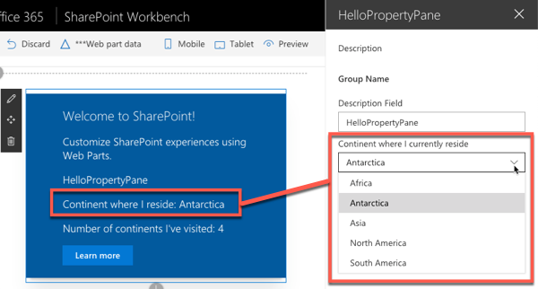

<a name="exercise3"></a>

## Exercise 3: Leveraging the SPFx PnP Reusable Property Pane Controls

In this exercise, you will learn how to leverage existing 3rd party controls from the the popular [PnP SPFx Reusable Property Pane Controls](https://sharepoint.github.io/sp-dev-fx-property-controls) project.

1. Create a new SPFx project that contains a single web part using no JavaScript framework for SharePoint Online with the Yeoman generator using the same steps from exercise 1. Allow the generator to scaffold the project and install all the necessary packages.
1. Install the PnP SPFx Reusable Property Pane Controls:
    1. Open a command prompt and change to the folder for the root of the project.
    1. Execute the following command to install the controls:

        ```shell
        npm install @pnp/spfx-property-controls --save --save-exact
        ```

### Add the People Picker control to the web part

1. Locate the web part class in the **src\webparts\\\*\\\*WebPart.ts** file.

    > The actual path will depends on the name you gave the web part when running the Yeoman generator.

1. Within the webpart class, add the following `import` statements to the top of the file after the existing `import` statements:

    ```ts
    import {
      IPropertyFieldGroupOrPerson,
      PropertyFieldPeoplePicker,
      PrincipalType
    } from '@pnp/spfx-property-controls/lib/PropertyFieldPeoplePicker';
    ```

1. Locate the interface for the web part... it will be located immediately after the `import` statements and be named something similar to `IHelloWorldWebPartProps`, depending on the name of the web part.

    Add the following property to the interface to store the people selected by the new control you are about to add to the property pane:

    ```ts
    people: IPropertyFieldGroupOrPerson[];
    ```

1. Update the rendering to display the selected people:
    1. Locate the web part's `render()` method.
    1. Within this method there is an HTML anchor `<a>` element. Add the following immediately after the `<a>` element:

        ```html
        <div class="selectedPeople"></div>
        ```

    1. Add the following code at the end of the `render()` method. If any people have been selected, this will display their full names & email addresses in the `<div>` element you just added to the rendering:

        ```ts
        if (this.properties.people && this.properties.people.length > 0) {
          let peopleList: string = '';
          this.properties.people.forEach((person) => {
            peopleList = peopleList + `<li>${ person.fullName } (${ person.email })</li>`;
          });

          this.domElement.getElementsByClassName('selectedPeople')[0].innerHTML = `<ul>${ peopleList }</ul>`;
        }
        ```

1. Add the property pane field control to the property pane:
    1. Locate the web part's `getPropertyPaneConfiguration()` method.
    1. Within the `groupFields` array, add the following people picker field control. This will bind the field control to the `people` property previously added to the web part's properties:

        ```ts
        PropertyFieldPeoplePicker('people', {
          label: 'Property Pane Field People Picker PnP Reusable Control',
          initialData: this.properties.people,
          allowDuplicate: false,
          principalType: [PrincipalType.Users, PrincipalType.SharePoint, PrincipalType.Security],
          onPropertyChange: this.onPropertyPaneFieldChanged,
          context: this.context,
          properties: this.properties,
          onGetErrorMessage: null,
          deferredValidationTime: 0,
          key: 'peopleFieldId'
        })
        ```

### Test the web part

In order to test the web part, it should be run in a SharePoint Online environment where there are multiple users / groups. The benefit of using the people picker control is that it contains the logic necessary to call the SharePoint APIs that list users and groups within the current site.

1. Start the project by executing `gulp serve --nobrowser` from the command line in the root of the project.
1. Open a browser and navigate to a SharePoint Online site's hosted SharePoint workbench that contains a few users in it:

    ```
    https://[your-spo-tenant].sharepoint.com/[your-spo-site]/_layouts/15/workbench.aspx
    ```

1. Add the web part to the page using the same process from the previous exercises.
1. Once the web part has been added to the page, open the property pane with the edit web part icon using the same process from the previous exercises.
1. Use the input control to find and select a user from the current site as shown in the following figure:

    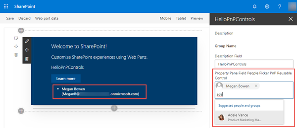

### Add the Collection Data control to the web part

1. Locate the web part class in the **src\webparts\\\*\\\*WebPart.ts** file.

    > The actual path will depends on the name you gave the web part when running the Yeoman generator.

1. Within the webpart class, add the following `import` statements to the top of the file after the existing `import` statements:

    ```ts
    import { 
      PropertyFieldCollectionData, 
      CustomCollectionFieldType 
    } from '@pnp/spfx-property-controls/lib/PropertyFieldCollectionData';
    ```

1. Locate the interface for the web part... it will be located immediately after the `import` statements and be named something similar to `IHelloWorldWebPartProps`, depending on the name of the web part.

    Add the following property to the interface to store the collection of data entered in the new control you are about to add to the property pane:

    ```ts
    expansionOptions: any[];
    ```

1. Update the rendering to display the selected people:
    1. Locate the web part's `render()` method.
    1. Add the following immediately after the `<div class="selectedPeople"></div>` element that you added previously:

        ```html
        <div class="expansionOptions"></div>
        ```

    1. Add the following code at the end of the `render()` method. If any people have been selected, this will display their full names & email addresses in the `<div>` element you just added to the rendering:

        ```ts
        if (this.properties.expansionOptions && this.properties.expansionOptions.length > 0) {
          let expansionOptions: string  = '';
          this.properties.expansionOptions.forEach((option) => {
            expansionOptions = expansionOptions + `<li>${ option['Region'] }: ${ option['Comment'] } </li>`;
          });
          if (expansionOptions.length > 0) {
            this.domElement.getElementsByClassName('expansionOptions')[0].innerHTML = `<ul>${ expansionOptions }</ul>`;
          }
        }
        ```

1. Add the property pane field control to the property pane:
    1. Locate the web part's `getPropertyPaneConfiguration()` method.
    1. Within the `groupFields` array, add the following field collection control. This will bind the field control to the `expansionOptions` property previously added to the web part's properties:

        ```ts
        PropertyFieldCollectionData('expansionOptions', {
          key: 'collectionData',
          label: 'Possible expansion options',
          panelHeader: 'Possible expansion options',
          manageBtnLabel: 'Manage expansion options',
          value: this.properties.expansionOptions,
          fields: [
            {
              id: 'Region',
              title: 'Region',
              required: true,
              type: CustomCollectionFieldType.dropdown,
              options: [
                { key: 'Northeast', text: 'Northeast' },
                { key: 'Northwest', text: 'Northwest' },
                { key: 'Southeast', text: 'Southeast' },
                { key: 'Southwest', text: 'Southwest' },
                { key: 'North', text: 'North' },
                { key: 'South', text: 'South' }
              ]
            },
            {
              id: 'Comment',
              title: 'Comment',
              type: CustomCollectionFieldType.string
            }
          ]
        })
        ```

### Test the web part

In order to test the web part, it should be run in a SharePoint Online environment where there are multiple users / groups.

1. If you stopped the local webserver after adding the people picker control, start the project by executing `gulp serve --nobrowser` from the command line in the root of the project.
1. Open a browser and navigate to a SharePoint Online site's hosted SharePoint workbench that contains a few users in it:

    ```
    https://[your-spo-tenant].sharepoint.com/[your-spo-site]/_layouts/15/workbench.aspx
    ```

1. Add the web part to the page using the same process from the previous exercises.
1. Once the web part has been added to the page, open the property pane with the edit web part icon using the same process from the previous exercises.
1. Select the **Manage expansion options** button.
1. Enter a few values in the provided fields, then select **Save**.

    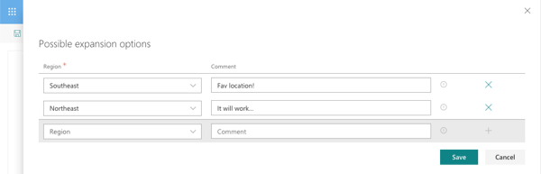

1. Notice the values entered are displayed within the web part:

    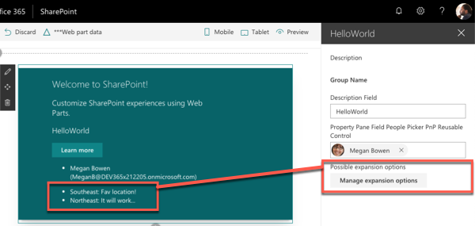